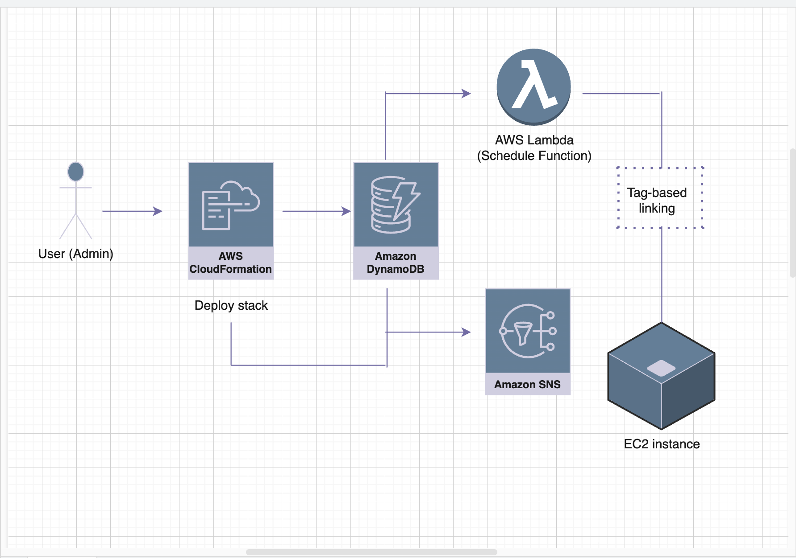

# aws-instance-schedule

This project implements the **AWS Instance Scheduler**, a solution that helps reduce AWS costs by automatically starting and stopping EC2 instances based on user-defined schedules.  
It uses a CloudFormation stack to deploy necessary AWS services including DynamoDB, Lambda, EventBridge, and SNS. Schedules and periods are stored in DynamoDB, and EC2 instances are managed using tag-based linking.  
Ideal for non-production environments such as development, testing, or training, this solution ensures resources run only when needed.

